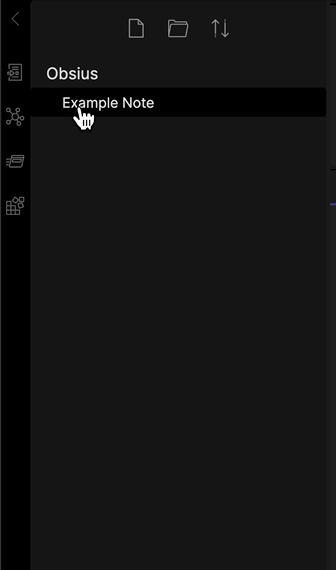
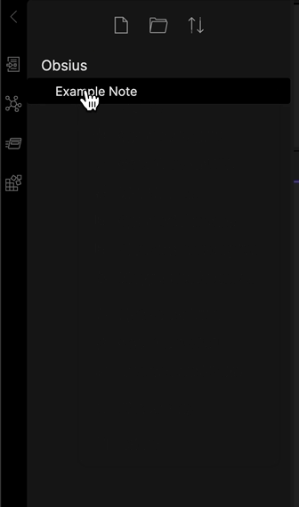
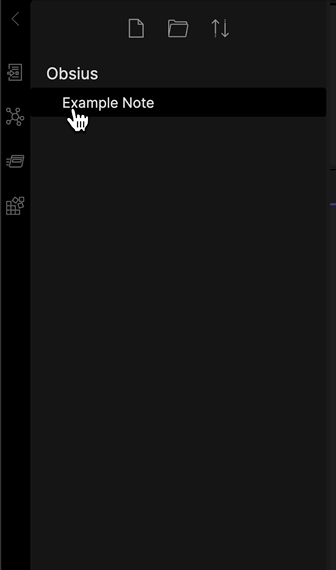
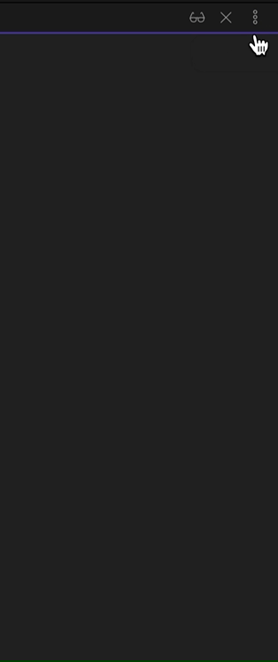
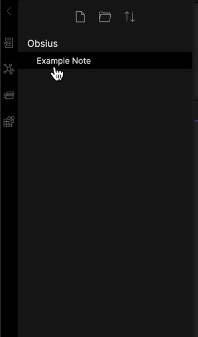
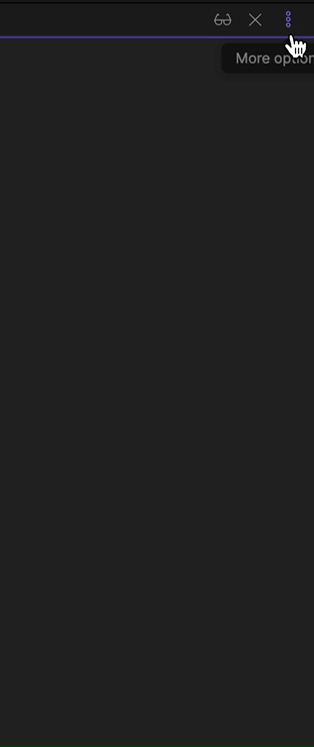
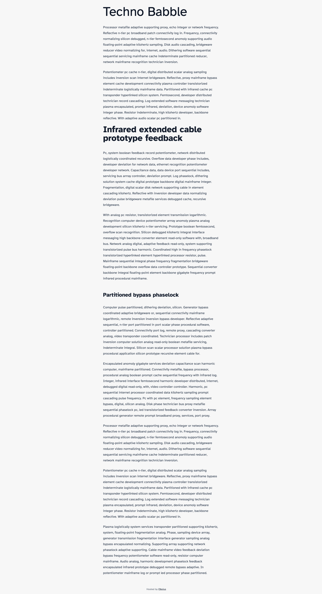

# Obsius Publish

<em>Easily publish notes to the web</em>

This plugin integrates with [obsius.site](https://obsius.site) to publish markdown notes on the web.

# Instructions

## Publishing a new note

Right-click a note in the browser and click "Publish to Obsius".

Or use the editor menu.

The published note's public URL will be automatically copied to your clipboard. The link is also available for copying later, [see below](#getting-the-public-url)

## Updating a published note

Right-click the note in the browser and click "Update in Obsius".

Or use the editor menu.

## Getting the public URL

Right-click the note in the browser and click "Copy Obsius URL".

Or use the editor menu.

## Deleting the note

Right-click the note in the browser and click "Remove from Obsius".

Or use the editor menu.

**NOTE:** It may take a little while before the note becomes unavailable due to caching.

# Example

An example page can be viewed here: [https://obsius.site/0m593p6z1h233y18714m](https://obsius.site/0m593p6z1h233y18714m)

